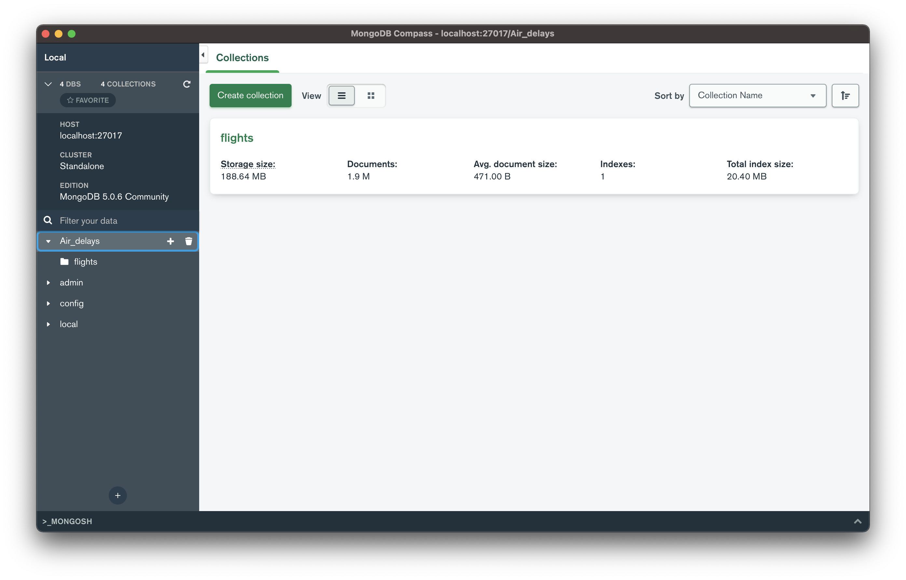
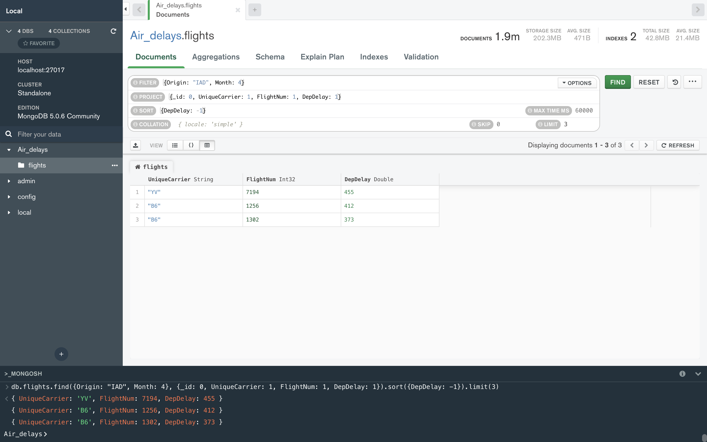
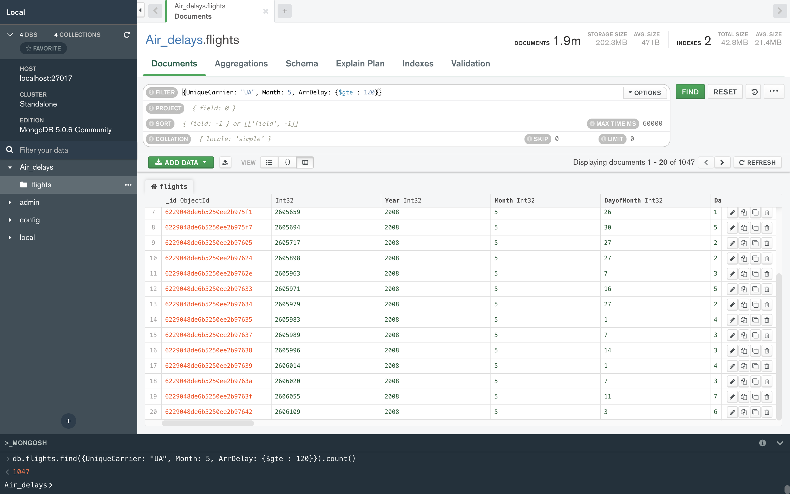
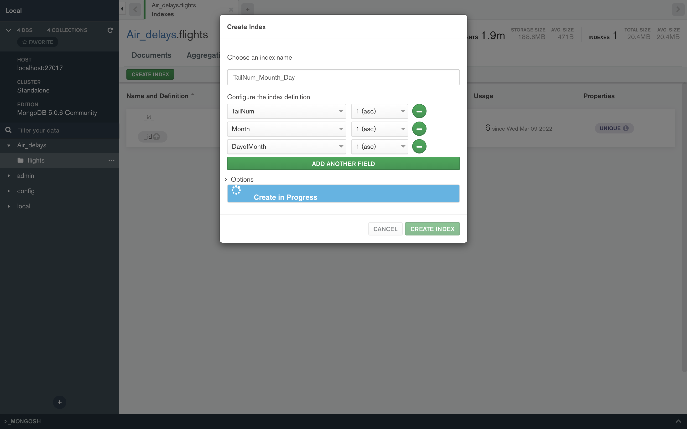
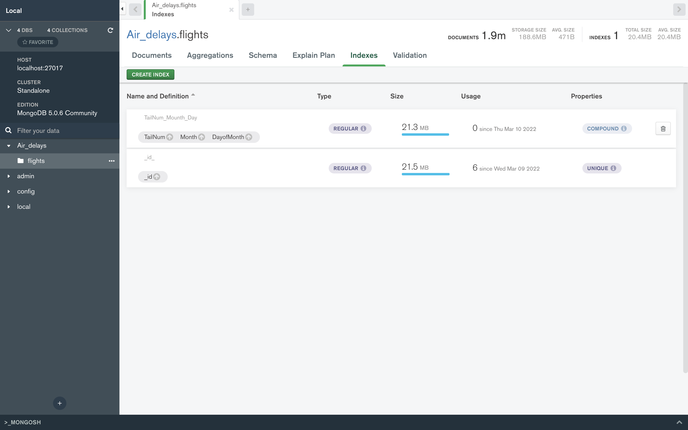
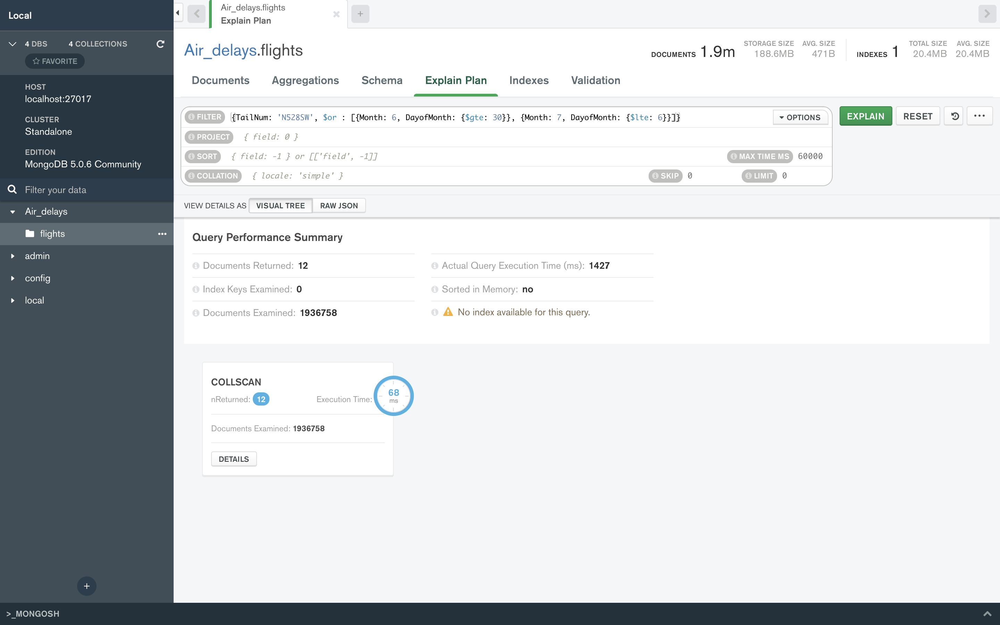
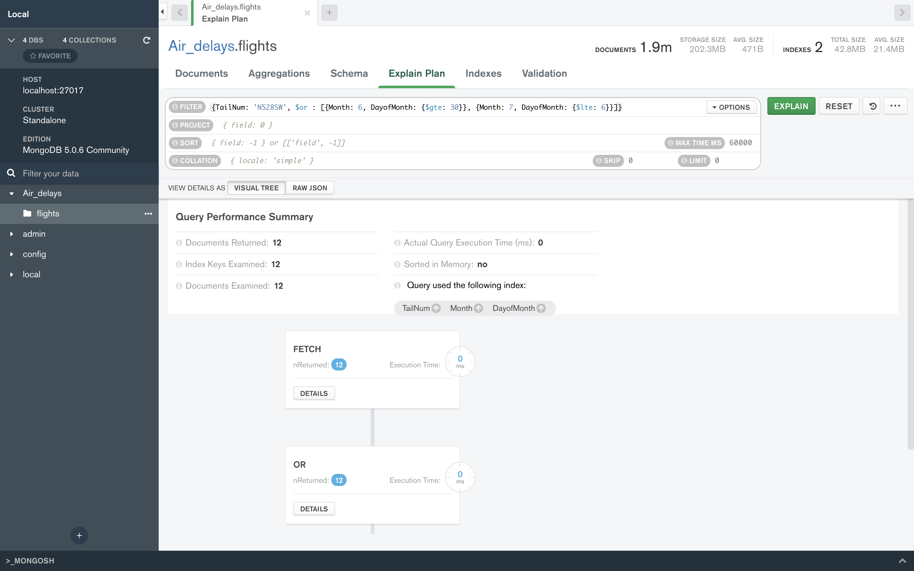
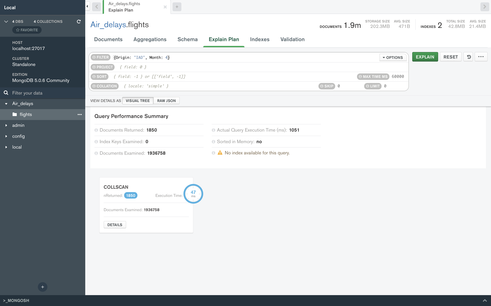
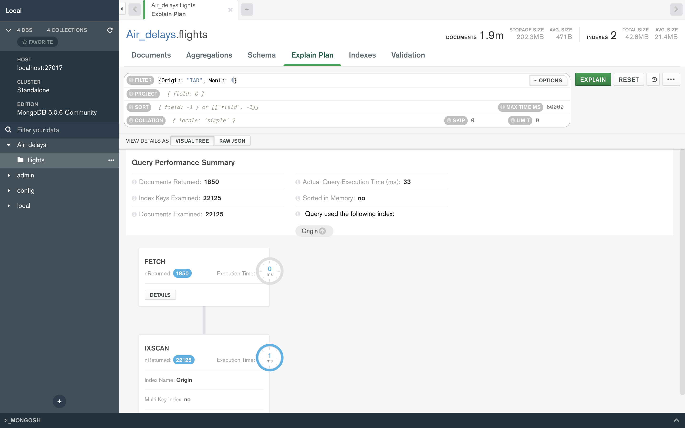

# mongodb
## Импорт файла
Я выбрал довольно объемный [dataset](https://www.kaggle.com/datasets?search=airlines) (2 миллиона документов). Он содержит подробные данные о статусе всех внутренних рейсов в США за 2008 год. Коллекция flights содержит 30 столбцов. При импорте через Compas столкнулся с проблемой: не всегда верно импортировались форматы данных, почему-то инты переводил в строки (исправил перезагрузкой компьютера).


Собственно показывается краткая информация о базе данных, ничего интересного.

## Запросы и изменения

Для наглядности запросы были выполнены в командной строке и в web интерфейсе Compass.

### 1 запрос
Вывести (топ 3) номера рейсов и времена задержки вылета в апреле из аэропорта 'IAD'.
   
Код запроса:
   
```javascript
db.flights.find({Origin: "IAD", Month: 4}, {_id: 0, UniqueCarrier: 1, FlightNum: 1, DepDelay: 1}).sort({DepDelay: -1}).limit(3)
```
 
Результат работы:



### 2 запрос
Вывести количество рейсов авиакомпании United Airlines, прибывших в пункт назначения на 120 минут позже запланированного в мае.

Код запроса:
   
```javascript
db.flights.find({UniqueCarrier: "UA", Month: 5, ArrDelay: {$gte : 120}}).count()
```

Результат работы:
   
   

Для наглядности выведем общее число рейсов авиакомпании United Airlines в мае:

```javascript
db.flights.find({UniqueCarrier: "UA", Month: 5}).count()
12128
```

### 3 запрос
Вывести сколько пролетал за год конкретный борт.

Код запроса:
   
```javascript
db.flights.aggregate({$match: { TailNum: "N712SW"}}, {$group: {_id: 'id', FlyedDist: {$sum: '$Distance'}, FlyedTime: {$sum: '$AirTime'}}})
```
Результат работы:
   
   
### Изменение
Ситуация: в бд произошла ошибка и все рейсы запланированные с 30 июня по 6 июля на которых был установлен борт ‘N528SW’  заменить на борт ‘X777XX’.

Найдем все нужные нам рейсы:
```javascript
db.flights.find({TailNum: 'N528SW', $or : [{Month: 6, DayofMonth: {$gte: 30}}, {Month: 7, DayofMonth: {$lte: 6}}]}, {_id: 0, UniqueCarrier: 1, FlightNum: 1, CRSDepTime:1, Month: 1, DayofMonth: 1})
```

Изменяем:
```javascript
db.flights.updateMany({TailNum: 'N528SW', $or : [{Month: 6, DayofMonth: {$gte: 30}}, {Month: 7, DayofMonth: {$lte: 6}}]}, {$set: {TailNum: "X777XX"}})
```
Если снова запустить первый запрос - ничего не выдаст.

Изменения подтверждаются:
```javascript
db.flights.find({TailNum: 'X777XX', $or : [{Month: 6, DayofMonth: {$gte: 30}}, {Month: 7, DayofMonth: {$lte: 6}}]}, {_id: 0, UniqueCarrier: 1, FlightNum: 1, CRSDepTime:1, Month: 1, DayofMonth: 1})
```
Возвращаем все обратно:
```javascript
db.flights.updateMany({TailNum: 'X777XX', $or : [{Month: 6, DayofMonth: {$gte: 30}}, {Month: 7, DayofMonth: {$lte: 6}}]}, {$set: {TailNum: "N528SW"}})
```

## Индексы
### Создание индекса


### Индекс создался


### Перый запрос без индекса
Время выполнения 68 ms


### Перый запрос c индексом
Время выполнения 0 ms


### Второй запрос без индекса
Время выполнения 47 ms


### Второй запрос c индексом
Время выполнения 1 ms


# Вывод
1. Использование MongoDb целесообразно в случае, когда нам нужно иметь возможность масштабировать данные, быстро и много их читать.
2. Данная база данных не слишком удобна если мы храним множеством коллекций, взаимодействие между коллекциями усложнено, хоть и можно использовать JS, также делать выборку вычисляя промежуточные данные (не логические функции) мне показалось невозможным (Пример: вывести ..., такое что разность в конкретных столбцах равна ...).
3. Использование индексов многократно ускоряет работу базы данных, но индексы много весят.
